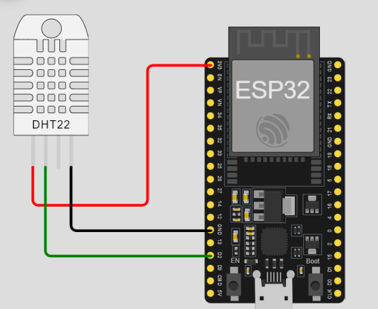
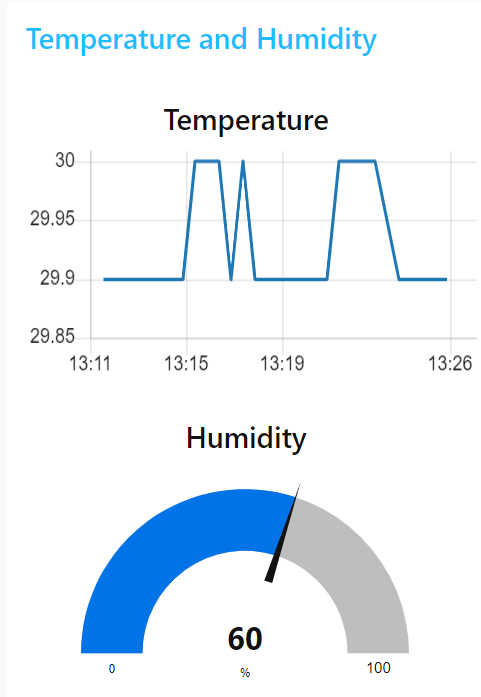

# Send DHT22 data with ESP32 using MQTT to Node-Red Dashboard


## Flow diagram of the Project


### Step 1: Install the Required Libraries
- Open an Arduino IDE --> Tools --> Manage Libraries
- Search and install the following libraries
    ```
    pubsubclient
    WiFi
    DHT sensor library for ESPx
    ```

### Step 2: Hardware Schematic
- Four pin DHT22


### Step 3: Running the program
- Copy the code to the Arduino IDE
- Setup the Board and Port
- Connect the ESP32 to the USB port of the computer
- Upload the code
- Monitor the values in the Serial monitor

### Step 4: Setup the Node-RED flow

- Open Node-RED URL in the browser
- Click on Menu --> Manage Palette
- Search for "node-red-dashboard" and install it. 
- Import the flow using the following code

```
[{"id":"5e04b9dd.81c658","type":"tab","label":"MQTT Dashboard","disabled":false,"info":""},{"id":"235eb13c.0e6e6e","type":"mqtt in","z":"5e04b9dd.81c658","name":"","topic":"iotfrontier/temperature","qos":"2","datatype":"auto-detect","broker":"6ec4dcef.913b24","nl":false,"rap":false,"inputs":0,"x":144,"y":347,"wires":[["7e75f56e.a3ef1c","125d1072.694a2"]]},{"id":"7e75f56e.a3ef1c","type":"debug","z":"5e04b9dd.81c658","name":"","active":true,"tosidebar":true,"console":false,"tostatus":false,"complete":"payload","targetType":"msg","statusVal":"","statusType":"auto","x":341,"y":314,"wires":[]},{"id":"98d00e19.a6762","type":"mqtt in","z":"5e04b9dd.81c658","name":"","topic":"iotfrontier/humidity","qos":"2","datatype":"auto-detect","broker":"6ec4dcef.913b24","nl":false,"rap":false,"inputs":0,"x":130,"y":120,"wires":[["07048bb50e4963b7","89bc352.e41bac8"]]},{"id":"89bc352.e41bac8","type":"ui_gauge","z":"5e04b9dd.81c658","name":"Humidity","group":"92a9cd27.99b9d","order":0,"width":0,"height":0,"gtype":"gage","title":"Humidity","label":"%","format":"{{value}}","min":0,"max":"100","colors":["#00b3d9","#0073e6","#001bd7"],"seg1":"33","seg2":"66","diff":false,"className":"","x":340,"y":180,"wires":[]},{"id":"125d1072.694a2","type":"ui_chart","z":"5e04b9dd.81c658","name":"Temperature","group":"92a9cd27.99b9d","order":1,"width":0,"height":0,"label":"Temperature","chartType":"line","legend":"false","xformat":"HH:mm","interpolate":"linear","nodata":"","dot":false,"ymin":"","ymax":"","removeOlder":1,"removeOlderPoints":"","removeOlderUnit":"3600","cutout":0,"useOneColor":false,"useUTC":false,"colors":["#1f77b4","#aec7e8","#ff7f0e","#2ca02c","#98df8a","#d62728","#ff9896","#9467bd","#c5b0d5"],"outputs":1,"useDifferentColor":false,"className":"","x":341,"y":374,"wires":[[]]},{"id":"07048bb50e4963b7","type":"debug","z":"5e04b9dd.81c658","name":"","active":true,"tosidebar":true,"console":false,"tostatus":false,"complete":"payload","targetType":"msg","statusVal":"","statusType":"auto","x":350,"y":100,"wires":[]},{"id":"6ec4dcef.913b24","type":"mqtt-broker","name":"","broker":"broker.hivemq.com","port":"1883","clientid":"","autoConnect":true,"usetls":false,"protocolVersion":"4","keepalive":"15","cleansession":true,"birthTopic":"","birthQos":"0","birthPayload":"","birthMsg":{},"closeTopic":"","closePayload":"","closeMsg":{},"willTopic":"","willQos":"0","willPayload":"","willMsg":{},"userProps":"","sessionExpiry":""},{"id":"92a9cd27.99b9d","type":"ui_group","name":"Temperature and Humidity","tab":"6f670e80.d2e0f","order":1,"disp":true,"width":"6","collapse":false,"className":""},{"id":"6f670e80.d2e0f","type":"ui_tab","z":"5e04b9dd.81c658","name":"Dashboard","icon":"dashboard"}]
```
- Deploy the flow
- Navigate to the following URL and modify the <your IP address>. For example http://localhost:1880/ui
```
http://<your IP address>:1880/ui
```
- Monitor the values in the Dashboard as below
  


